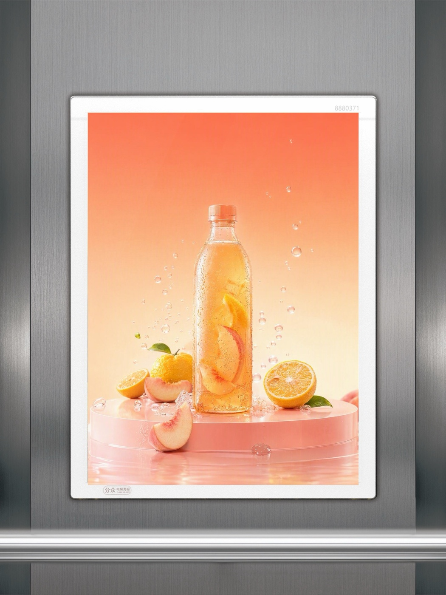
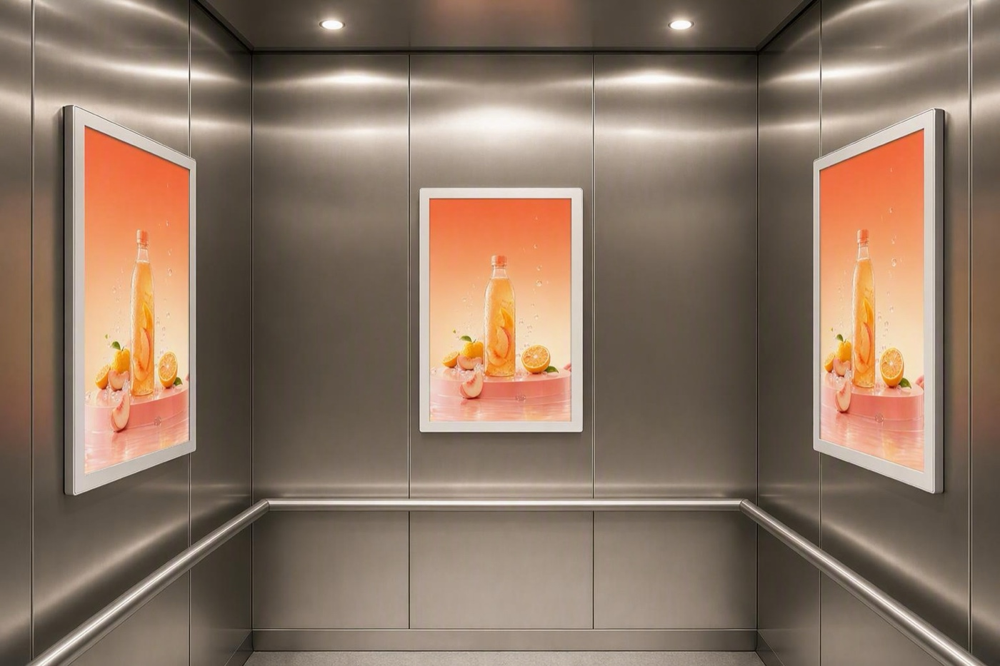
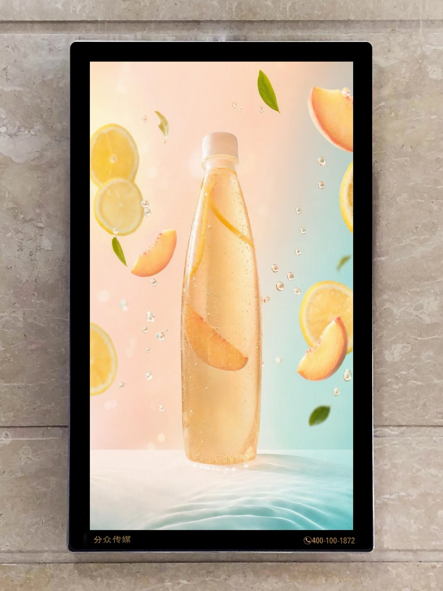
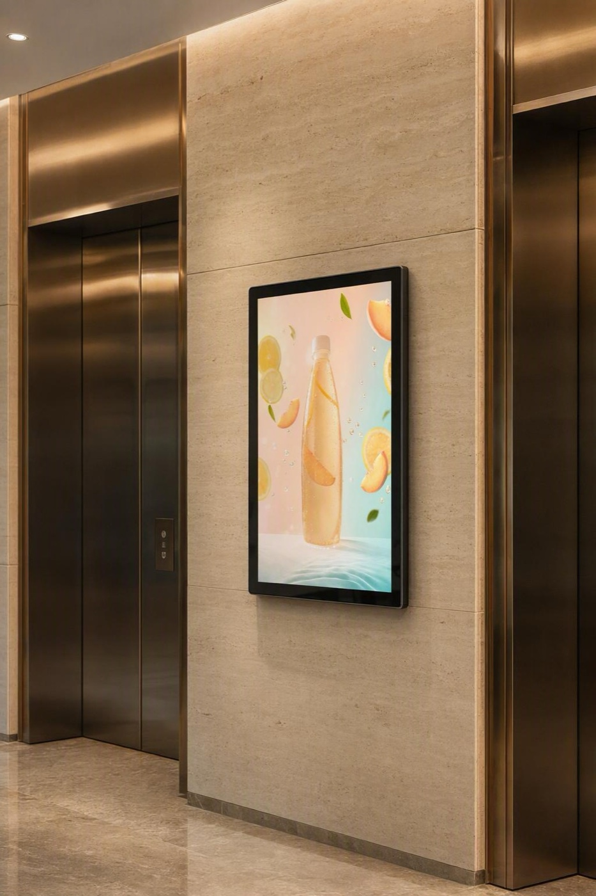
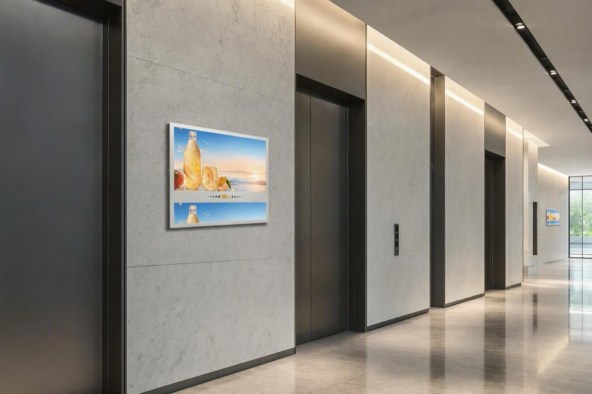

# FocusMedia Image Gen Skill

把已有海报、KV 或 TVC 画面，制作成媒体框体正确、空间比例可信的分众传媒效果图。

它适用于电梯电视 LCD、32 寸智能屏和海报框架。每次任务默认交付两张图：一张无环境的完整带框演示图，以及一张安装进真实电梯厅或电梯轿厢的环境效果图。

## 能解决什么

- 把品牌海报、KV 或视频画面放进正确的分众媒体框体
- 生成无人、有人、广角或多媒体同层可见的真实环境效果图
- 保持 LCD 上屏、下屏和中部标识带的正确结构
- 保持智能屏的黑色硬件、边框、反射和安装深度
- 保持海报框的实体框体、玻璃反光和纸质印刷感
- 制作精确 `16:3` LCD 下屏创意及带框 LCD TVC Demo

## 三套已验证标准框体

| 媒介 | 标准文件 | 可替换内容 |
| --- | --- | --- |
| 32 寸智能屏 | `assets/framed-demo-standards/smart-32-standard.png` | 9:16 竖屏展示面 |
| 32 寸楼宇 LCD | `assets/framed-demo-standards/lcd-32-standard.png` | 16:9 上屏与 16:3 下屏 |
| 海报框架 | `assets/framed-demo-standards/poster-frame-standard.png` | 玻璃后的纸质海报面 |

智能屏当前只提供经过验证的 32 寸完整框体。带框演示图始终保留完整硬件边界，只替换展示面。

## 快速开始

安装后，直接在支持 Skill 的 Agent 中描述你的目标媒介和源素材。

```text
Use $focusmedia-image-gen，把这张海报生成分众传媒海报框架效果图。
输出一张无环境带框图，一张电梯轿厢环境图。
```

```text
Use $focusmedia-image-gen，把这张 KV 做成 32 寸智能屏效果图。
保持标准黑色外框，环境放在高品质电梯厅，画面里要有人群尺度。
```

```text
Use $focusmedia-image-gen，把这支 16:9 TVC 做成 32 寸分众 LCD 带框 Demo。
下屏保持静态，上屏在指定帧切换，输出视频、contact sheet 和 report。
```

## 工作方式

1. 识别素材类型和目标媒介：精确创意、完整设计板、待生成创意或既有环境图。
2. 先用标准框体完成带框产品演示图，锁定硬件身份和展示比例。
3. 从真实参考图库选择相应的空间、视角和人物尺度，环境图以真实照片的透视、灯光和结构为基础。
4. 仅替换媒体展示面，保留电梯门、按钮、扶手、墙缝、地面、天花、反射和安装深度。
5. 对 LCD、多人尺度、多台同层 LCD 同播，以及小字和二维码做最终检查。

同层可见的多台 LCD 必须播放相同的上屏和下屏内容。每一轮修改都回到原始真实参考图，合并已确认要求后重新生成。

## 真实环境参考图库

完整参考图库通过阿里云只读静态地址按需下载，Git 包不携带原始大图。

| 参考级别 | 数量 | 适用场景 |
| --- | ---: | --- |
| 默认主力 | 58 | 干净、高质、硬件清晰的常规效果图 |
| 场景参考 | 98 | 宏大空间、人物尺度、多海报同框、轿厢内和特殊视角 |
| 本地缩略图 | 16 | 离线快速查看 |

暗沉、老旧、杂乱或明显拉低媒介质感的环境图已排除。参考库现含 LCD 83 张、智能屏 21 张、海报框架 52 张。

默认从主力参考开始：

```bash
scripts/select_media_references.py --media lcd --scene elevator-hall --limit 3
scripts/fetch_reference_images.py --media lcd --limit 2
```

有明确画面意图时，按用途调用场景参考：

```bash
# 宏大空间与广角冲击力
scripts/select_media_references.py --media lcd --tier scenario --use-case wide-impact --limit 3

# 多海报同框的轿厢效果
scripts/select_media_references.py --media poster --tier scenario --use-case multi-frame-poster-coverage --limit 3

# 人物与设备的尺度关系
scripts/select_media_references.py --media smart --tier scenario --use-case people-scale --limit 2
```

下载后的文件会进入 `.focusmedia-cache/references/`，并自动进行 checksum 校验。使用者不需要服务器账号、SSH Key、API Key 或上传权限。

## LCD 下屏与 TVC

LCD 下屏必须保持精确 `16:3`，使用双保护带生成和裁切，避免超宽画面比例漂移。

```bash
scripts/prepare_lcd_lower_band.py template \
  --canvas 1536x1024 \
  --guide lower-band-guide.png \
  --mask lower-band-mask.png \
  --manifest lower-band-manifest.json

scripts/prepare_lcd_lower_band.py crop \
  --input returned.png \
  --output lower-1920x360.png \
  --report lower-crop-report.json
```

干净的 LCD 带框图只修改标准模板中的上、下展示面：

```bash
scripts/composite_lcd_screens.py \
  --main main-1920x1080.png \
  --lower lower-1920x360.png \
  --output framed-lcd.png
```

## 示例

以下示例均为虚构、无品牌的饮品创意，只用于展示媒体框体与空间效果，不对应真实客户或投放案例。

### 海报框架

| 原始创意 | 带框演示图 | 环境效果图 |
| --- | --- | --- |
|  |  |  |

### 智能屏

| 原始创意 | 带框演示图 | 环境效果图 |
| --- | --- | --- |
|  |  |  |

### 楼宇 LCD

| 原始创意 | 带框演示图 | 环境效果图 |
| --- | --- | --- |
|  |  |  |

## 安装

把仓库安装到 Agent 的 Skill 目录：

```bash
# Codex
git clone https://github.com/JoeSangAI/focusmedia-image-gen.git ~/.codex/skills/focusmedia-image-gen

# Claude Code
git clone https://github.com/JoeSangAI/focusmedia-image-gen.git ~/.claude/skills/focusmedia-image-gen
```

不支持自动发现 Skill 的 Agent，可直接读取 `SKILL.md` 与 `references/`。

## 依赖与安全

图片几何、标准框体和 LCD 下屏处理需要 Python 3 与 Pillow：

```bash
python3 -m pip install -r requirements.txt
```

带框 LCD TVC Demo 还需要本机安装 `ffmpeg` 与 `ffprobe`。

远程参考服务器只提供 GET / HEAD 静态下载，不提供上传、删除、WebDAV 或写入 API。仓库不包含服务器密钥。

生产级小字、Logo 和二维码建议在最终一步通过专业透视与光照合成回贴，以确保内容精确。
